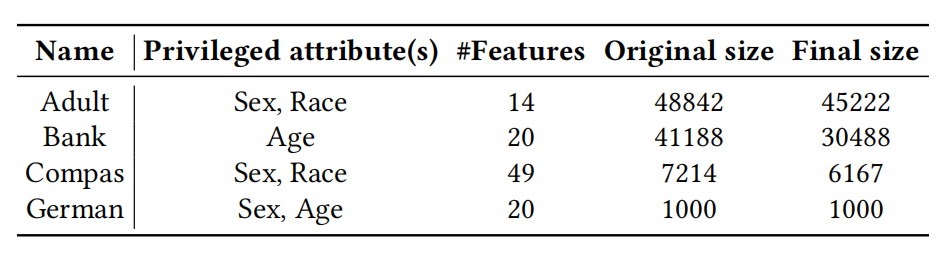

# FMT

Welcome to visit the homepage of our paper entitled "A Post-Training Framework for Improving the Performance of Deep Leaning Models via Model Transformation". The homepage contains the source code of our fairness improvement approach FMT and other existing fairness improvement methods that we use in our paper, as well as the intermediate results, the installation instructions, and a replication guideline.
Particularly, the implementation and experimental results of our paper regarding improving the robustness of DL models can be downloaded at [Dare](https://zenodo.org/record/7018397#.Y7eGMC8Rpqs).

## Experimental Environment

We use Python 3.7 for our experiments. We use the IBM AI Fairness 360 (AIF360) toolkit for implementing fairness improvement methods and computing fairness metrics.

Installation instructions for Python 3.7 and AIF360 can be found on [https://github.com/Trusted-AI/AIF360](https://github.com/Trusted-AI/AIF360). That page provides several ways for the installation. We recommend creating a virtual environment for it (as shown below), because AIF360 requires specific versions of many Python packages which may conflict with other projects on your system. If you would like to try other installation ways or encounter any errors during the installation proces, please refer to the page ([https://github.com/Trusted-AI/AIF360](https://github.com/Trusted-AI/AIF360)) for help.

### Conda

Conda is recommended for all configurations. [Miniconda](https://conda.io/miniconda.html) is sufficient if you do not already have conda installed.

Then, to create a new Python 3.7 environment, run:

```bash
conda create --name fairness python=3.7
conda activate fairness
pip install -r requirements.txt
# pip install -r requirements.txt -i https://pypi.tuna.tsinghua.edu.cn/simple
```

## Datasets

We use the 4 default datasets supported by the AIF360 toolkit. **When running the scripts that invoke these datasets, you will be prompted how to download these datasets and in which folders they need to be placed.** You can also refer to [https://github.com/Trusted-AI/AIF360/tree/master/aif360/data](https://github.com/Trusted-AI/AIF360/tree/master/aif360/data) for the raw data files.



## Scripts and Results

The repository contains the following files and folders:

- `baselines/` contains code for implementing four state-of-the-art fairness improvement approaches (i.e., REW, ADV, ROC and CARE).
- `data/` contains original datasets and our processed data.
- `datasets/` contains code for processing raw datasets.
- `features/` contains json files for feature mapping when processing datasets.
- `models/` contains our trained source model used for the following fairness improvement.
- `plot/` contains code for drawing plots and pictures.
- `data_helper.py` is the code for generating processed data and mutation samples.
- `fmt.py` is the code for our method **F**airness improvement by **M**odel **T**ransformation (**FMT**).
- `fmt_variants.py` is the code for the three variants of our **FMT**.
- `mutation.py` is the code for mutant generation.
- `requirements.txt` is the list of required packages and corresponding versions for environment setup.
- `train.py` is the code for training source models used for fairness improvement.
- `utils.py` is the code for some utility functions used by our methods.
- `RQ5_results/`, `RQ6_results/`, and `RQ7_results/` contain the raw results of the models after applying different fairness improvement methods/strategies. These folders also contain some plots.

## Reproduction

You can reproduce the results for our research questions (RQs) based on the intermediate results provided by us.

### Training Source Model

The trained source models are saved in `models` directory. You can also reproduce them as follows:

```bash
python train.py -d adult
python train.py -d bank
python train.py -d compas
python train.py -d german
```

### RQ5: Overall Effectiveness of FMT

This RQ evaluates the effectiveness of FMT over four datasets involving seven different privileged attributes, and compares the results with four state-of-the-art fairness improvement approaches. To answer this RQ, we need to run the code as follows.

(1) We obtain the ML performance and fairness metric values obtained by our approach FMT.

`fmt.py` supports three arguments: `-d` configures the dataset; `-p` configures the protected attribute; `-m` configures the training data construction strategy.

```bash
python fmt.py -d adult -p race -m single
python fmt.py -d adult -p race -m dual
python fmt.py -d adult -p sex -m single
python fmt.py -d adult -p sex -m dual

python fmt.py -d bank -p age -m single
python fmt.py -d bank -p age -m dual

python fmt.py -d compas -p race -m single
python fmt.py -d compas -p race -m dual
python fmt.py -d compas -p sex -m single
python fmt.py -d compas -p sex -m dual

python fmt.py -d german -p age -m single
python fmt.py -d german -p age -m dual
python fmt.py -d german -p sex -m single
python fmt.py -d german -p sex -m dual
```

As a result, we can obtain the results of FMT. The result for each combination is included in the `RQ5_results/fmt/` folder.

(2) We obtain the ML performance and fairness metric values obtained by existing bias mitigation methods in the ML community: REW (`baselines/Fair360/rew.py`), ROC (`baselines/Fair360/roc.py`), and ADV (`baselines/Fair360/adv.py`). The three methods support three arguments: `-d` configures the dataset; `-p` configures the protected attribute. We take the REW method as an example to show how to run the code.

```bash
python baselines/Fair360/rew.py -d adult -p race
python baselines/Fair360/rew.py -d adult -p sex

python baselines/Fair360/rew.py -d bank -p age

python baselines/Fair360/rew.py -d compas -p race
python baselines/Fair360/rew.py -d compas -p sex

python baselines/Fair360/rew.py -d german -p age
python baselines/Fair360/rew.py -d german -p sex
```

### RQ6: Contribution of Model Transformation

This RQ investigates how much the model transformation in our framework contributes to the effectiveness of FMT. We conduct an ablation study with the variants of $FMT^{-s}$ and $FMT^{−sl}$, which are implemented as `fmt_variants.py`. The results are included in the `RQ6_results/` folder.

```bash
python fmt_variants.py -d adult -p race -m single -v remove_s
python fmt_variants.py -d adult -p race -m single -v remove_sl
python fmt_variants.py -d adult -p race -m dual -v remove_s
python fmt_variants.py -d adult -p race -m dual -v remove_sl

python fmt_variants.py -d adult -p sex -m single -v remove_s
python fmt_variants.py -d adult -p sex -m single -v remove_sl
python fmt_variants.py -d adult -p sex -m dual -v remove_s
python fmt_variants.py -d adult -p sex -m dual -v remove_sl

python fmt_variants.py -d bank -p age -m single -v remove_s
python fmt_variants.py -d bank -p age -m single -v remove_sl
python fmt_variants.py -d bank -p age -m dual -v remove_s
python fmt_variants.py -d bank -p age -m dual -v remove_sl

python fmt_variants.py -d compas -p race -m single -v remove_s
python fmt_variants.py -d compas -p race -m single -v remove_sl
python fmt_variants.py -d compas -p race -m dual -v remove_s
python fmt_variants.py -d compas -p race -m dual -v remove_sl

python fmt_variants.py -d compas -p sex -m single -v remove_s
python fmt_variants.py -d compas -p sex -m single -v remove_sl
python fmt_variants.py -d compas -p sex -m dual -v remove_s
python fmt_variants.py -d compas -p sex -m dual -v remove_sl

python fmt_variants.py -d german -p age -m single -v remove_s
python fmt_variants.py -d german -p age -m single -v remove_sl
python fmt_variants.py -d german -p age -m dual -v remove_s
python fmt_variants.py -d german -p age -m dual -v remove_sl

python fmt_variants.py -d german -p sex -m single -v remove_s
python fmt_variants.py -d german -p sex -m single -v remove_sl
python fmt_variants.py -d german -p sex -m dual -v remove_s
python fmt_variants.py -d german -p sex -m dual -v remove_sl
```

### RQ7: Contribution of Data Augmentation in FMT

This RQ investigates the performance of our specially designed data augmentation algorithm. We compare the results of FMT with the variant of $FMT^{rand}$, which is implemented as `fmt_variants.py`. The results are included in the `RQ7_results/` folder.

```bash
python fmt_variants.py -d adult -p race -m single -v rand
python fmt_variants.py -d adult -p race -m dual -v rand
python fmt_variants.py -d adult -p sex -m single -v rand
python fmt_variants.py -d adult -p sex -m dual -v rand

python fmt_variants.py -d bank -p age -m single -v rand
python fmt_variants.py -d bank -p age -m dual -v rand

python fmt_variants.py -d compas -p race -m single -v rand
python fmt_variants.py -d compas -p race -m dual -v rand
python fmt_variants.py -d compas -p sex -m single -v rand
python fmt_variants.py -d compas -p sex -m dual -v rand

python fmt_variants.py -d german -p age -m single -v rand
python fmt_variants.py -d german -p age -m dual -v rand
python fmt_variants.py -d german -p sex -m single -v rand
python fmt_variants.py -d german -p sex -m dual -v rand
```

## Acknowledgement

Thanks to the authors of existing fairness improvement methods for open source, to facilitate our implementation of this paper. Therefore, when using our code or data for your work, please also consider their repositories, including [AIF360](https://github.com/Trusted-AI/AIF360), [DARE](https://doi.org/10.5281/zenodo.7018397) and [MAAT](https://github.com/chenzhenpeng18/FSE22-MAAT).
